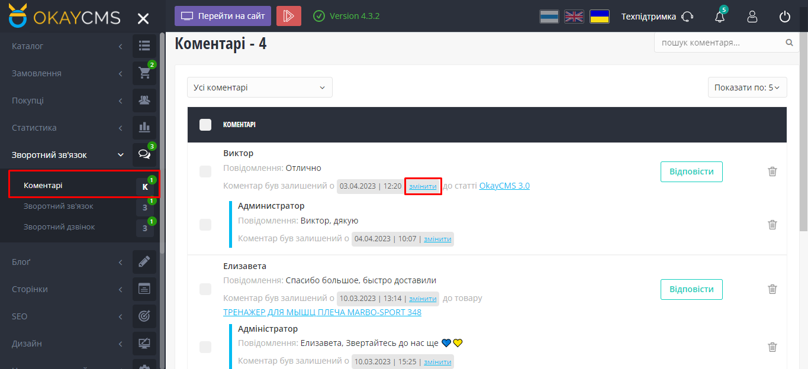
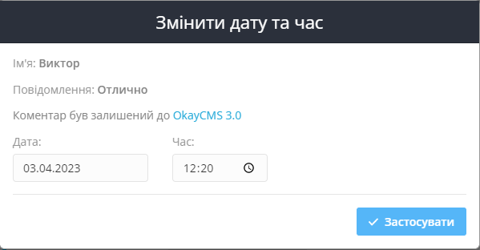

#  Изменение даты и времени комментариев

<b>Module DateReview - <a href="https://okay-cms.com/products/datereview-datereview" target="_blank">Маркетплейс</a></b>

Данный модуль позволяет изменять дату и время для каждого отзыва или комментария.
В административной панели, на странице "Обратная связь - Комментарии", под каждым комментарием появляется ссылка "Изменить", расположенная после фразы "Комментарий был оставлен в дд.мм.гг | чч:мм". При нажатии на эту ссылку появляется окно для ввода новой даты и времени.

# Результат работы модуля

 
 

# Зачем мне этот модуль?

Использование этого модуля предпочтительнее, чем ручное изменение даты в базе данных, поскольку это может привести к нежелательным последствиям. Если вы внесете ошибку в дату или время, это может повлиять на другие данные в базе данных, что может привести к нарушению целостности данных. Использование данного модуля дает вам уверенность в том, что изменения будут внесены правильно и безопасно для данных.

